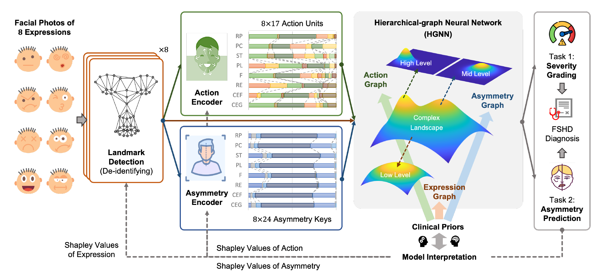

# Hierarchical Graph Neural Network for Interpretable Facial Weakness Assessment in FSHD

This repository contains the code for paper **"Hierarchical Graph Neural Network for Interpretable Facial Weakness Assessment in Facioscapulohumeral Muscular Dystrophy."** The proposed hierarchical graph neural network (HGNN) uses de-identified facial features from standardized photographs to perform two tasks jointly:

- Facial weakness severity grading: absence, moderate, or severe
- Facial weakness asymmetry prediction: non-asymmetry, left-side predominant, or right-side predominant



## Method

Each participant is represented by eight standardized facial expressions:

1. Resting position
2. Closing the eyes gently
3. Closing the eyes firmly
4. Raising the eyebrows
5. Frowning
6. Pursing the lips
7. Showing the teeth
8. Puffing the cheeks

The model processes 41 de-identified features per expression:

- 17 facial action units
- 10 bilateral facial-asymmetry deviations
- 7 left-side facial measurements
- 7 right-side facial measurements

## Repository

| File                        | Description                                                                             |
|-----------------------------|-----------------------------------------------------------------------------------------|
| `assets/`                   | Figures extracted from the manuscript                                                   |
| `config.py`                 | Expression, action-unit, asymmetry-feature, and class definitions                       |
| `environment.yml`           | Conda environment                                                                       |
| `graph.py`                  | Expression, action-unit, and facial-asymmetry graph definitions                         |
| `metrics.py`                | Classification metric definitions and calculations                                     |
| `model.py`                  | HGNN architecture                                                                       |
| `train_eval.py`             | Training and 10-fold cross-validation                                                   |
| `facial_asymmetry_func.py`  | Geometric calculation of facial asymmetry keys                                          |
| `get_facial_landmarks.py`   | Landmark detection using OpenFace, FAN, and Py-Feat                                     |
| `check_facial_landmarks.py` | Visualization of facial landmarks                                                       |
| `data_statistic.py`         | Class-wise summaries of action units, asymmetry features, and expression-level features |
| `Shapley.py`                | SHAP-based interpretation of HGNN predictions                                           |
| `util.py`                   | Pickle utilities                                                                        |

## Environment

| Library                   | Compatible version |
|---------------------------|--------------------|
| Python                    | 3.8.18             |
| PyTorch                   | 1.9.0              |
| torchvision               | 0.10.0             |
| torch-geometric           | 2.0.4              |
| torch-scatter             | 2.0.9              |
| torch-sparse              | 0.6.12             |
| torch-cluster             | 1.5.9              |
| torch-spline-conv         | 1.2.1              |
| NumPy                     | 1.23.5             |
| pandas                    | 1.5.3              |
| Matplotlib                | 3.7.5              |
| SciPy                     | 1.10.1             |
| scikit-learn              | 1.3.2              |
| SHAP                      | 0.41.0             |
| XGBoost                   | 1.7.6              |
| Joblib                    | 1.2.0              |
| OpenCV Python             | 4.8.1.78           |
| face-alignment            | 1.3.5              |
| Py-Feat                   | 0.6.1              |
| openpyxl                  | 3.1.2              |
| numba                     | 0.58.1             |
| numexpr                   | 2.8.4              |
| seaborn                   | 0.12.2             |
| nltools                   | 0.4.7              |
| scikit-image              | 0.21.0             |
| h5py                      | 3.10.0             |
| Pillow                    | 10.1.0             |
| PyWavelets                | 1.4.1              |
| tqdm                      | 4.66.1             |
| Kornia                    | 0.6.12             |
| PyAV                      | 10.0.0             |
| easing-functions          | 1.0.4              |
| celluloid                 | 0.2.0              |
| cloudpickle               | 2.2.1              |
| packaging                 | 23.2               |
| slicer                    | 0.0.7              |
| OpenFace Python interface | 0.2.2              |
| dlib                      | 19.24.2            |

The experiments used an NVIDIA RTX 3090 GPU and an Intel Xeon CPU. Create the environment from `environment.yml`:

```bash
conda env create -f environment.yml
conda activate hgnn-fshd
```

Update the 68-point landmark predictor path in `get_facial_landmarks.py` after the environment is created.

## Data format

The training script expects `AU_asymmetry_data.pkl` in the repository root. The file must contain a dictionary keyed by subject identifier with the following structure:

```text
subject_id
├── labels [2, 3]
└── expression_name
    ├── Action Unit: mapping with 17 values
    └── Facial Asymmetry
        ├── Deviation: mapping with 10 values
        ├── Left: mapping with 7 values
        └── Right: mapping with 7 values
```

The first label row encodes severity in the order `absence`, `moderate`, and `severe`. The second row encodes asymmetry in the order `non-asymmetry`, `left`, and `right`. The resulting tensors have the following dimensions:

| Tensor           | Shape     | Description                                                    |
|------------------|-----------|----------------------------------------------------------------|
| Expression input | `[8, 41]` | Eight expressions by 17 action units and 24 asymmetry features |
| Action input     | `[17, 8]` | Seventeen action units across eight expressions                |
| Asymmetry input  | `[24, 8]` | Twenty-four asymmetry features across eight expressions        |
| Label            | `[2, 3]`  | Two three-class classification targets                         |

## Training and evaluation

Before training, define the configuration block at the top of `train_eval.py`:

- `DATA_PATH`: your data path to `AU_asymmetry_data.pkl`
- `CHECKPOINT_DIR`: local directory to save outputs
- `DEVICE`: GPU device index
- `K_FOLD`: number of cross-validation folds
- `MAX_EPOCH`: maximum number of epochs
- `INITIAL_LR`: initial Adam learning rate
- `PATIENCE_LR`: epochs without improvement before learning-rate decay
- `PATIENCE_EARLY_STOP`: epochs without improvement before training stops
- `DECAY_FACTOR`: learning-rate decay factor
- `FLIP_AUG`: training-only horizontal-flip augmentation
- `SCALER`: z-score normalization

Run training and evaluation from the repository root:

```bash
python train_eval.py
```
## License

This project will be released under the MIT License upon publication.
